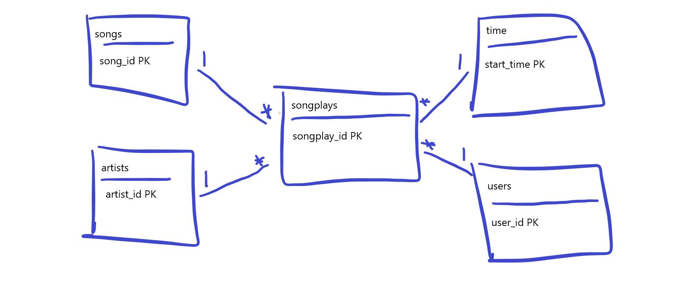

# Sparkify with AWS

Sparkify is a company that serves music as its product, this company stores data from its users and the main purpose of this project is to go through the ETL phases to transform transactional data into analytical information. The analysis that could be done by Sparkify is for example:
1. Analysis of customers based on time spent
2. Analysis of type of music to focus on, based on music plays
3. Analysis of the most common type of user

# Sparkify's Database and ETL process

## Database
The database schema will be divided in 2, 1 for the staging tables and another for the final tables.

### Staging tables
The staging tables are built to match the shape of our S3 data source. The schema is very straight. It is composed only by 2 tables: staging_events and staging_songs.

### Final tables
The final tables are populated from the bulk data that we have in the staging tables, the final tables are following a star schema so there will be 4 dimension tables and 1 fact table.

**Dimension tables**
- Users
- Time
- Artists
- Songs

**Fact table**
- Songplays

## ETL process
The ETL process is defined by the execution of 2 python scripts:
1. [create_tables.py](create_tables.py)
2. [etl.py](etl.py)

In addition, there was created a Python notebook [Process_&_analytics.ipynb](Process_&_analytics.ipynb) in where we can do some exploration within the schemas created during the ETL process

### [create_tables.py](create_tables.py)
This python script can be summarized into 3 steps:
1. Connect to our Redshift cluster
2. Drop the existing tables
3. Create the staging and final tables

### [create_tables.py](create_tables.py)
This python script can be summarized into 3 steps:
1. Connect to our Redshift cluster
2. Copy the data from the S3 into the staging tables
3. Insert the data from the staging tables into the final tables