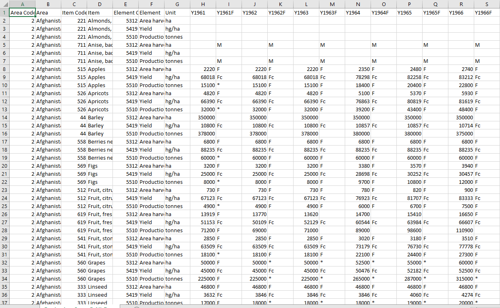
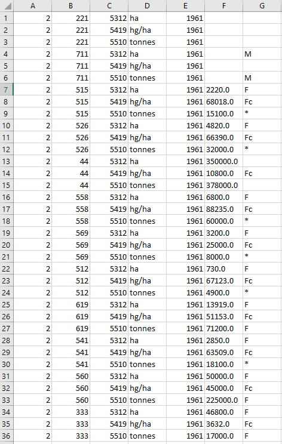

# Analytics in agriculture

## Scope of the project

The scope of this project is to prove the need of data-driven decisions in the primary sector. Specifically, the agricultural sector.

### Data sources

For this project we have used 2 data sources.

- [Production data (crops)](http://www.fao.org/faostat/en/#data/QC)
- [Trade data (crops & products)](http://www.fao.org/faostat/en/#data/TP)

### Outcome of this project

This data engineering project is mainly oriented on the processes needed to go from raw data, to curated ready-to-use data.

For a non-techincal end-user, there is a report where all of this data can be accesed and consumed. Check out this [Power BI](https://powerbi.microsoft.com/) report: [FAO report udacity capstone project](https://app.powerbi.com/view?r=eyJrIjoiMGUxYjU3ZTMtNjVhZi00OTZjLTgxMmUtYzdjOTliOWJkZDIxIiwidCI6ImJjNTE3MzE3LTYxMWQtNDg4YS05NmJiLTRkZWVmZDJkZTY1MCIsImMiOjl9)

## Data modeling

You can either [download production data](http://fenixservices.fao.org/faostat/static/bulkdownloads/Production_Crops_E_All_Data.zip) and [download trade data](http://fenixservices.fao.org/faostat/static/bulkdownloads/Trade_Crops_Livestock_E_All_Data.zip) to have a look at the raw data.
For the data modeling part, there was needed mainly to restructure the tabular data and split it into dimensions and one fact table.
After one step adapting csv data into table format we can see how raw data looks like for [Production data](http://www.fao.org/faostat/en/#data/QC).

[Trade data](http://www.fao.org/faostat/en/#data/TP) follows the same structure. The first step is to extract what will be our future dimension tables from this big table.

> IMPORTANT: Each big table contains different labels. Therefore, in order to create our dimension tables, we will need to combine the extraction from production and trade data.

From these 2 main tables, we created the following dimensions:
- dim_areas
- dim_elements
- dim_items
- dim_countries
- dim_flags

And the fact table called **fact_fao** looks like this after the trasnformation:

The dimensions are directly created and populated. Unfortunately, we can't upload the fact table directly from the memory, it could be time consuming (there are more than 9 million rows) and instead we can load the data directly from an S3 bucket. The process to populate the fact table is the following one:

> Table in memory -> local machine -> S3 bucket -> database

After these steps and other data cleaning steps taken to ensure data quality, we can conclude with the following schema / Data model:

> IMPORTANT: The visual report will include one more dimension table (date), virtually created and stored in-memory.

## How would Spark or Airflow be incorporated?

### Airflow

Right now the heavy part of the process comes from processing production and trade data into our fact table. This process is almost parallel but it could be improved differentiating the process into subprocesses of each main table. This sequence could grow horizontally adding other sources with similar structure that are already available.

### Spark

Spark could be very useful to save time wasted writing and moving the same data between storages. As it was described, the process had to move the data from memory (local), to hard drive (local), from hard drive to hard drive (AWS) and from hard drive (AWS) to memory (database). With spark, we could reduce this process drastically.

## Approaches for different future scenarios

### Data was increased by 100x

Let's go back and remind the tools that we are using for this project:
- Python as programming language and Data processing engine 
- Redshift as cloud datawarehouse
- s3 bucket as storage for big data

Now, the approach that would improve the capabilities of the current system and resist the heavy workloads is the following one:
- Spark as Data processing engine (pyspark)
- Python as programming language
- Redshift as cloud datawarehouse
- s3 buckets as storage for big data
- Airflow to schedule the data pipelines

Spark and Airflow joined the game, each one has a big role now that before wasn't needed because of the heavy workloads that our system needs to handle. With spark, we will optimize the amount of memory (also read and writes) and therefore, time that we will need to complete the ETL. Also, thanks to Airflow, the ETL will be now divided into stages and steps that before took seconds may take now half an hour. So we need to ensure that if something fails, it needs to be isolated and correctly handled to avoid expensive loops (of time and money) for the same ETL.

### The pipelines were run on a daily basis by 7 am

Well if we are using our original dataset, we can go back to our current system and just add a couple more gadgets to make this seem like a production environment. Until now we assumed the machine that we are using is a local computer. The first thing we would do is create a virtual machine, for example an EC2 machine that could have automated its start and stop thanks to AWS Lambda funcions. At start, we have setted up and automated script that runs the ETL. So, at the end we only needed to set up the hour into the Lambda function to ensure that we are running the ETL everyday at 7 a.m.

### The database needed to be accessed by 100+ people

If the database needed to be accessed by that many people, first we would measure when the traffic happens the most, after gathering some usage data we would set up scheduled ETLs at the hours that the database is not busy. We are not talking about how optimal is the design of the database schema, but about how are we going to handle the lack of resources at some busy hours and how to adapt the automated task to our dyanmic working day.