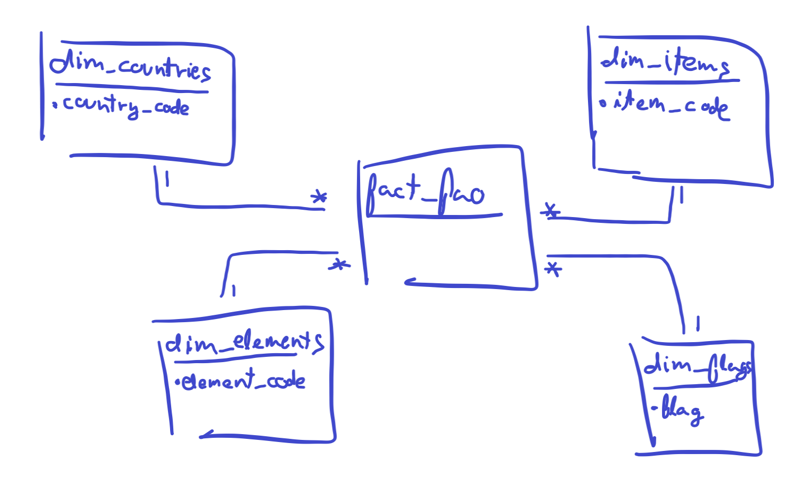

# Analytics in agriculture

## Scope of the project

The scope of this project is to prove the need of data-driven decisions in the primary sector. Specifically, the agricultural sector.

### Data sources

For this project we have used 2 data sources.

- [Production data (crops)](http://www.fao.org/faostat/en/#data/QC)
- [Trade data (crops & products)](http://www.fao.org/faostat/en/#data/TP)

### Outcome of this project

This data engineering project is mainly oriented on the processes needed to go from raw data, to curated ready-to-use data.

For a non-techincal end-user, there is a report where all of this data can be accesed and consumed. Check out this [Power BI](https://powerbi.microsoft.com/) report: [FAO report udacity capstone project](https://app.powerbi.com/view?r=eyJrIjoiMGUxYjU3ZTMtNjVhZi00OTZjLTgxMmUtYzdjOTliOWJkZDIxIiwidCI6ImJjNTE3MzE3LTYxMWQtNDg4YS05NmJiLTRkZWVmZDJkZTY1MCIsImMiOjl9)

## Data modeling

You can either [download production data](http://fenixservices.fao.org/faostat/static/bulkdownloads/Production_Crops_E_All_Data.zip) and [download trade data](http://fenixservices.fao.org/faostat/static/bulkdownloads/Trade_Crops_Livestock_E_All_Data.zip) to have a look at the raw data.
For the data modeling part, there was needed mainly to restructure the tabular data and split it into dimensions and one fact table.
After one step adapting csv data into table format we can see how raw data looks like for [Production data](http://www.fao.org/faostat/en/#data/QC).

[Trade data](http://www.fao.org/faostat/en/#data/TP) follows the same structure. The first step is to extract what will be our future dimension tables from this big table.

> IMPORTANT: Each big table contains different labels. Therefore, in order to create our dimension tables, we will need to combine the extraction from production and trade data.

From these 2 main tables, we created the following dimensions:
- dim_areas
- dim_elements
- dim_items
- dim_countries
- dim_flags

And the fact table called **fact_fao** looks like this after the trasnformation:

The dimensions are directly created and populated. Unfortunately, we can't upload the fact table directly from the memory, it could be time consuming (there are more than 9 million rows) and instead we can load the data directly from an S3 bucket. The process to populate the fact table is the following one:

> Table in memory -> local machine -> S3 bucket -> database

After these steps and other data cleaning steps taken to ensure data quality, we can conclude with the following schema / Data model:

> IMPORTANT: The visual report will include one more dimension table (date), virtually created and stored in-memory.

## How would Spark or Airflow be incorporated?

### Airflow

Right now the heavy part of the process comes from processing production and trade data into our fact table. This process is almost parallel but it could be improved differentiating the process into subprocesses of each main table. This sequence could grow horizontally adding other sources with similar structure that are already available.

### Spark

Spark could be very useful to save time wasted writing and moving the same data between storages. As it was described, the process had to move the data from memory (local), to hard drive (local), from hard drive to hard drive (AWS) and from hard drive (AWS) to memory (database). With spark, we could reduce this process drastically.