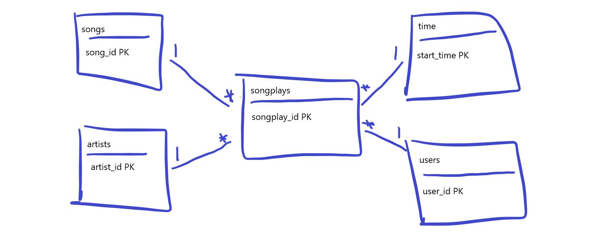

# Data Lake with Spark
In this section, you will find how to run an ETL data pipeline with Apache Spark and S3 AWS Buckets.

Sparkify is a company that serves music as its product, this company stores data from its users and the main purpose of this project is to go through the ETL phases to transform transactional data into analytical information. The analysis that could be done by Sparkify is for example:

1. Analysis of customers based on time spent
2. Analysis of type of music to focus on, based on music plays
3. Analysis of the most common type of user

# Sparkify's Database schema and ETL process

## Database
The database schema will be divided in 2, 1 for the staging tables and another for the final tables.

### source data
The source data is found in json files inside *s3://udacity-dend/* AWS Bucket, there are 2 data structures and 2 main root folders inside the source S3 Bucket: song_data and log_data.

### Final tables
The final tables are populated from the bulk data that we have in the source files/tables, the final tables are following a star schema so there will be 4 dimension tables and 1 fact table.

**Dimension tables**
- Users
- Time
- Artists
- Songs

**Fact table**
- Songplays

## ETL process
The ETL process is defined by the execution of 1 python script:
* [etl.py](etl.py)