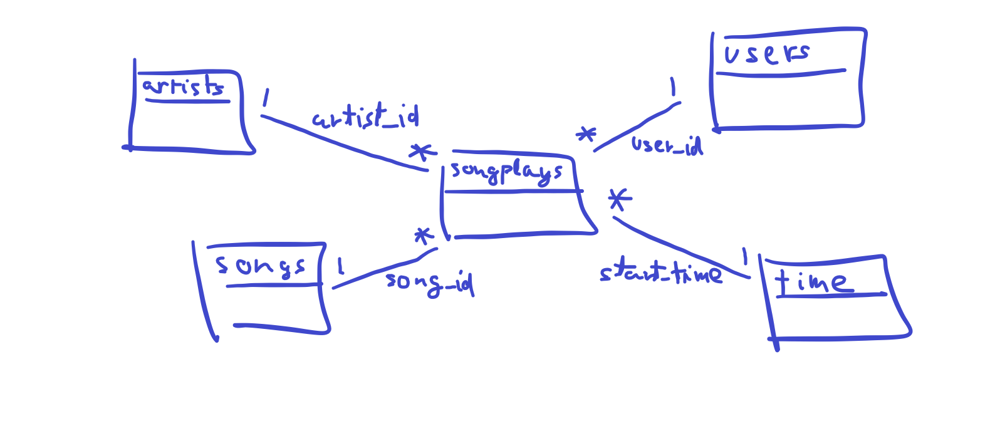

# Sparkify project

The database that was built and tested on this project has 2 objectives:
1. Store and provide to the end-user available songs that they can play in the Sparkify App (with all the data behind. Artist, song duration, release year...)
2. Store user data and metadata in order to analyze user activty, preferences, etc.

## Ideas for future analysis
1. Observe amount of users in free plan and paid plan to create custom offers to the greater group of users
    - Mainly users from free plan: Offer free paid plan for 1-3 months, create mid-range paid plan that gives acces to limited functionalities of the full paid plan.
    - Mainly users from paid plan: Marketing campaign about how many things are being included over time to keep users paying, create extra tools to connect Sparkify to other services and offer some of them free and some paid.

# Database schema and ETL pipeline

## Database schema


As we can see in the schema displayed above, the database is following a star schema. Where there are several dimensions with their own type of data and all of them converge into one fact table called **songplays**.

## ETL pipeline<a name="etl_pipeline"></a>

Here we will analyze the process that follows [etl.py](#etl.py).

The following method is the **main** method. This is the code that starts all the calls to the corresponding functions. Here is called the function **process_data** with 2 functions passed as parameters
```python
    #Connects to sparkify db
    conn = psycopg2.connect("host=127.0.0.1 dbname=sparkifydb user=student password=student")
    
    #Creates a crusor for the established connection
    cur = conn.cursor()
    
    #Call process_data functions
    process_data(cur, conn, filepath='data/song_data', func=process_song_file)
    process_data(cur, conn, filepath='data/log_data', func=process_log_file)

    #Closes the connection with the db
    conn.close()
```

Here is the definition of the function **Process_data**. This function is responisble for iterating over all the files from a directory and call the function passed to this function as an argument each time
```python
# get all files matching extension from directory
    all_files = []
    for root, dirs, files in os.walk(filepath):
        files = glob.glob(os.path.join(root,'*.json'))
        for f in files :
            all_files.append(os.path.abspath(f))

    # get total number of files found
    num_files = len(all_files)
    print('{} files found in {}'.format(num_files, filepath))

    # iterate over files and process
    for i, datafile in enumerate(all_files, 1):
        func(cur, datafile)
        conn.commit()
        print('{}/{} files processed.'.format(i, num_files))
```

This is the first function called from **process_data**, called **process_song_file**. This function is responsible for populating the artist table
```python
# open song file
    df = pd.read_json(filepath, typ='series')

    # insert song record
    song_data = df[['song_id', 'title', 'artist_id', 'year', 'duration']].values.tolist()
    cur.execute(song_table_insert, song_data)
    
    # insert artist record
    artist_data = df[['artist_id', 'artist_name', 'artist_location', 'artist_latitude', 'artist_longitude']].values.tolist()
    cur.execute(artist_table_insert, artist_data)
```

This is the second function called from **process_data**, called **process_log_file**. This function is responsible for populating users, time and songplays tables
```python
# open log file
    df = pd.read_json(filepath, lines=True)

    # filter by NextSong action
    df = df[df['page']=="NextSong"]

    # convert timestamp column to datetime
    t = pd.to_datetime(df['ts'], unit='ms')
    
    # insert time data records
    time_data = (t, t.dt.hour, t.dt.day, t.dt.week, t.dt.month, t.dt.year, t.dt.weekday)
    column_labels = ('timestamp', 'hour', 'day', 'week_number', 'month', 'year', 'weekday')
    time_df = pd.DataFrame({column_labels[i]: time_data[i] for i in range(len(column_labels))})

    for i, row in time_df.iterrows():
        cur.execute(time_table_insert, list(row))

    # load user table
    user_data = (df['userId'], df['firstName'], df['lastName'], df['gender'], df['level'])
    user_headers = ('user_id', 'first_name', 'last_name', 'gender', 'level')
    user_df = pd.DataFrame({user_headers[i]: user_data[i] for i in range(len(user_headers))}) 

    # insert user records
    for i, row in user_df.iterrows():
        cur.execute(user_table_insert, row)

    # insert songplay records
    for index, row in df.iterrows():
        
        # get songid and artistid from song and artist tables
        cur.execute(song_select, (row.song, row.artist, row.length))
        results = cur.fetchone()
        
        if results:
            songid, artistid = results
        else:
            songid, artistid = None, None

        # insert songplay record
        songplay_data = (index, pd.to_datetime(row['ts'], unit='ms'), row['userId'], row['level'], songid, artistid, row['sessionId'], row['location'], row['userAgent'])
        cur.execute(songplay_table_insert, songplay_data)
```

# How to run the Python scripts

To execute and test the code that was explained on the previous section you will need to execute the following **bash scripts**:

Execute the python script **create_tables.py** to generate the database Sparkify and its tables.
```bash
foo@bar:~$ python create_tables.py
```

Then, execute the script **etl.py** to perform the ETL process detailed in the [ETL pipeline section](#etl)
```bash
foo@bar:~$ python etl.py
```

To test the code executed, open the [Jupyter notebook](https://jupyter.org/) [test.ipynb](#test.ipynb) with the notebook editor of your preference.

# Files in the repository

## data<a name="data"></a>
This is not a file but a folder that contains all the data that will be used in the ETL process.

## create_tables.py<a name="create_tables.py"></a>
Python script that generates the database Sparkify and its tables.

## db_schema.png<a name="db_schema.png"></a>
Schema of the database used in this project.

## etl.ipynb<a name="etl.ipynb"></a>
[Jupyter notebook](https://jupyter.org/) used to divide the etl into clear steps before it is done in [etl.py](#etl.py).

## etl.py<a name="etl.py"></a>
Python script that executes the ETL process described [here](#etl_pipeline).

## sql_queries.py
Python class that contains only T-SQL statements ready to be executed out of this file, this approach follows a similar methodology to the [factory](https://en.wikipedia.org/wiki/Factory_method_pattern) programming pattern.

## test.ipynb
[Jupyter notebook](https://jupyter.org/) used to test and check that the etl process was executed correctly.